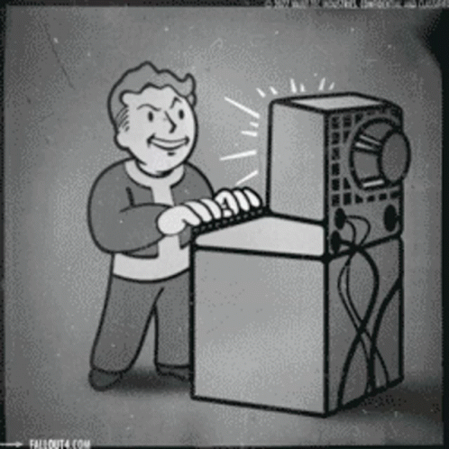

   
  <samp>
    Hello there! I'm <b><a rel="nofollow noopener noreferrer" target="_blank" href="https://github.com/wGamba">Francopaaa</a></b>.
     I'm a Computer Engineering Student from Bolivia
  </samp>
   
  <!-- Aquí está la etiqueta de imagen actualizada para usar tu archivo local -->
  

  
<b>About me</b>

   
  <samp>
    <ul>
      <li>I specialize in backend, workflow automation with n8n, and Linux.</li>
      <li>Future Pentester, currently learning cybersecurity.</li>
      <li>I play Dark Souls, Fallout, and Pokémon.</li>
      <li>Official member of <a href="https://www.bvb.de/" target="_blank" rel="noopener noreferrer">Borussia Dortmund</a> since 2023. Fan since 2013.</li>
      <li>My dream is to watch a UCL match at the Westfalenstadion.</li>
      <li>I'm always down for a game of football or Catan.</li>
    </ul>
  </samp>

## Skills 

 

  

